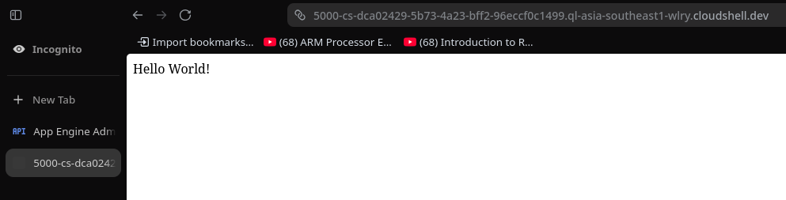
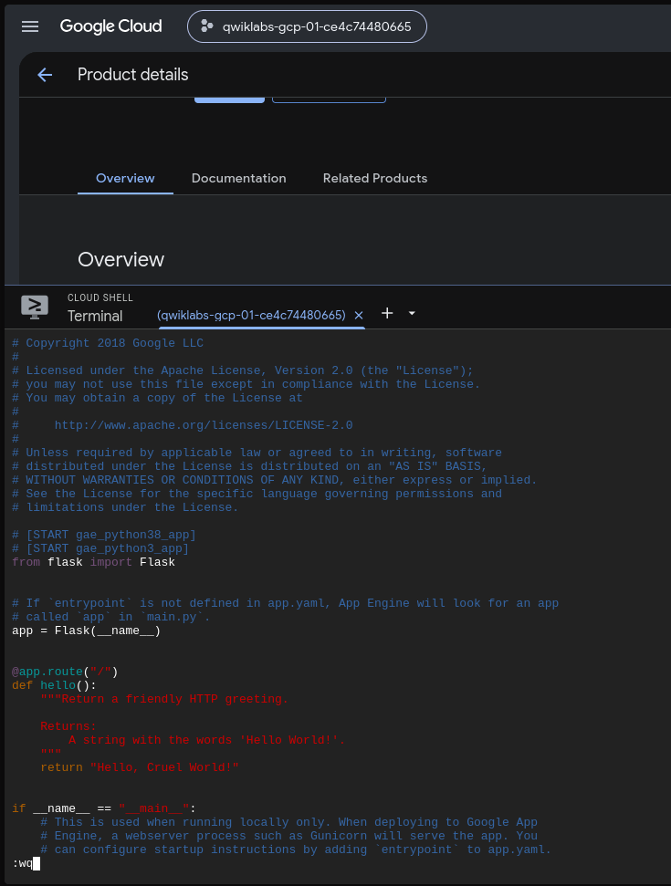
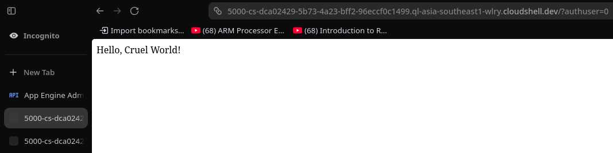
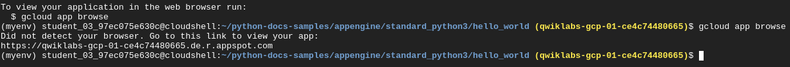

# Lab 3: App Engine Qwik Start – Python 🐍☁️

**Course:** Google Cloud Foundation Certificate  
**Lab ID:** GSP067  
**Difficulty:** Introductory  
**Time:** ~15 minutes

---

## What's This Lab About?

This lab introduced me to **Google App Engine**, one of Google Cloud's oldest and most powerful serverless platforms. The idea is simple — you write your code, upload it, and Google Cloud handles *everything* else: servers, scaling, load balancing, OS updates, you name it. As a developer, you just focus on the code. 🙌

---

## What I Did Step by Step

### ✅ Task 1 – Enable the App Engine Admin API

First things first — I had to enable the **App Engine Admin API** from the Google Cloud Console. This is what allows developers to manage App Engine applications programmatically. Pretty straightforward — just searched for it in the API Library and clicked Enable.

---

### ✅ Task 2 – Download the Hello World App

I cloned Google's official Python samples repo into Cloud Shell:

```bash
git clone https://github.com/GoogleCloudPlatform/python-docs-samples.git
cd python-docs-samples/appengine/standard_python3/hello_world
```

Then set up a Python virtual environment (good practice!):

```bash
sudo apt update
sudo apt install -y python3-venv
python3 -m venv myenv
source myenv/bin/activate
```

---

### ✅ Task 3 – Test the App Locally

Before deploying anything to the cloud, I ran it locally using Flask's dev server:

```bash
flask --app main run
```

The app ran on **port 5000** and I previewed it through Cloud Shell's Web Preview. It showed a simple — but satisfying — **"Hello World!"** in the browser. 🎉



---

### ✅ Task 4 – Make a Change to the Code

Now the fun part! I edited `main.py` using `nano` to change the message from `"Hello World!"` to `"Hello, Cruel World!"` 😄

```bash
nano main.py
```

Here's what the updated `main.py` looked like:



After saving and restarting the dev server, the browser now showed the updated message:



Small change, but it really shows how easy it is to iterate on an App Engine app locally before going live.

---

### ✅ Task 5 – Deploy to App Engine 🚀

This was the big moment — deploying the app to the actual cloud!

```bash
gcloud app deploy
```

I selected my region, confirmed the deployment details, and watched it go. The CLI output showed files being uploaded to Google Cloud Storage and the service being updated. After a minute or so — it was live!

Here's the terminal output after running `gcloud app browse`:



App Engine gave me a public URL: `https://qwiklabs-gcp-01-ce4c74480665.de.r.appspot.com`

---

### ✅ Task 6 – View the Live App

Opened the URL from the terminal and the app was live on the internet — showing **"Hello, Cruel World!"** on a real Google Cloud URL. That feeling never gets old. 😄🌍

---

## What I Learned

- **App Engine is truly serverless** — no servers, no VMs, no OS management. Google handles all of it.
- The **development workflow is smooth**: write → test locally → deploy. Fast iterations.
- Flask works great as the web framework for Python apps on App Engine.
- The `app.yaml` file is the key config file that tells App Engine how to run your app.
- App Engine isn't the only serverless option — **Cloud Functions** (for event-driven tasks) and **Cloud Run** (for containerized apps) are the newer alternatives from Google Cloud.

---

## Key Commands Cheat Sheet

| Command | What it does |
|---|---|
| `flask --app main run` | Run app locally on port 5000 |
| `gcloud app deploy` | Deploy app to App Engine |
| `gcloud app browse` | Get the live URL of your deployed app |
| `gcloud app logs tail -s default` | Stream live logs from your app |

---

## Reflections 💭

This was a really clean and beginner-friendly lab. What I appreciated most was the **local → cloud workflow** — you test everything locally first, then deploy with one command. No fussing with server configs or nginx or anything like that.

Also cool to think that App Engine has been around since **2008** — it's one of the OGs of serverless computing. A lot of the concepts we take for granted today (auto-scaling, managed runtimes) were pioneered right here.

On to the next lab! 💪

---

*Part of my Google Cloud Foundation Certificate journey. Previous labs: [Lab 1](#) | [Lab 2](#)*
