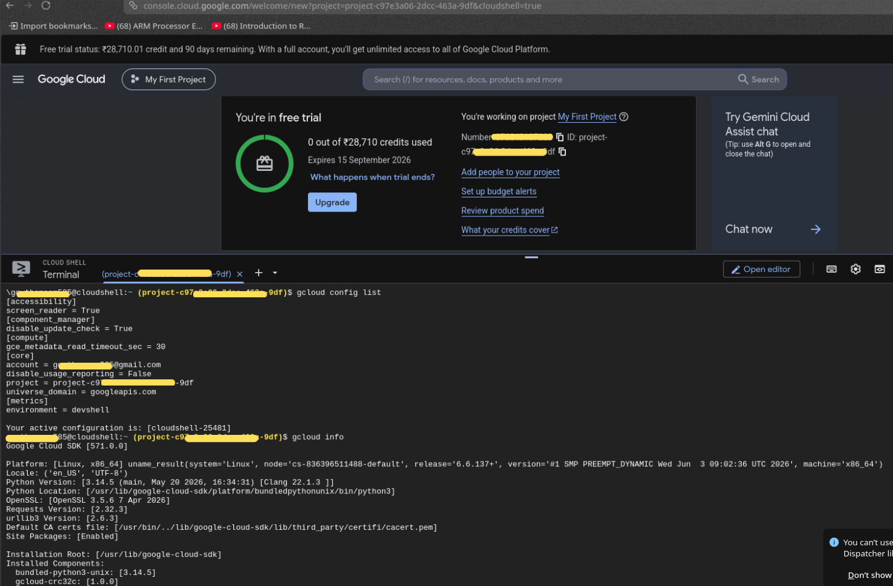

# ☁️ My First Google Cloud Platform (GCP) Exploration

Welcome to my cloud learning journey! This repo documents my very first steps into cloud computing and exploring the Google Cloud ecosystem.

---

## 🚀 Milestone 1: Setting Up the Cloud Shell

Today I officially activated my Google Cloud Free Trial and jumped into the **Google Cloud Shell** for the very first time.

### 💡 What I Learned About Cloud Shell

- 🖥️ **It's a real Linux environment** — clicking the Cloud Shell button spins up a temporary Linux VM running inside a Google data center.
- ⚡ **Bash works exactly as expected** — all the standard commands I already know (`pwd`, `ls`, `cat`, `echo`) behave identically here.
- 🛠️ **Pre-installed tools** — Google ships the Cloud Shell with the full Cloud SDK, Python, and Git already set up so you can start working immediately.

---

## 📸 Proof of Concept

Here's a snapshot of my terminal outputs running directly inside the browser console:



---

## 🧪 Commands I Ran (100% Safe & Free)

### 1. 🔍 Check Active Configuration

```bash
gcloud config list
```

✅ Confirmed my active Google developer account and verified the default project ID assigned to my free trial.

### 2. 📋 Inspect the Cloud SDK Environment

```bash
gcloud info
```

✅ Printed a detailed system report showing the underlying Linux kernel, Python paths, and active Cloud SDK component versions.

---

## 🎯 What's Next

Tonight I'm exploring Google's global infrastructure using `gcloud` commands to list available **data center regions** and **VM machine types** from around the world. 🌍
