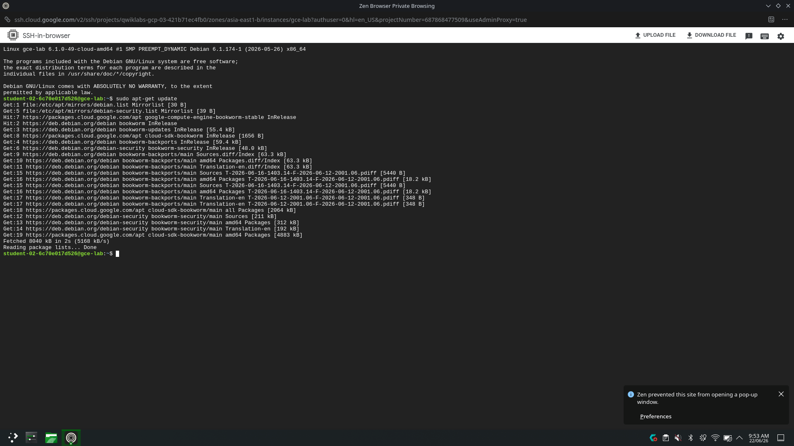
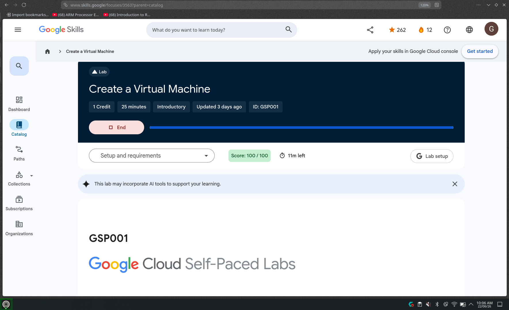

# 🌱 My GCloud VM Instances Lab Journal

> *Completed on: 22 June 2026 · Lab ID: GSP001 · Score: 100/100 🎉*

---

## ✨ What This Lab Was About

Today I explored **Google Compute Engine** — the backbone of Google Cloud's infrastructure! The goal was to create virtual machines (VMs), install a web server, and get comfortable with both the Cloud Console UI and the `gcloud` command line tool. Super fun and hands-on! 💻☁️

---

## 🗺️ Objectives I Completed

- ✅ Created a VM using the **Google Cloud Console**
- ✅ Installed an **NGINX web server** on it
- ✅ Created a second VM using the **`gcloud` command line**
- ✅ Connected via **SSH** directly from the browser

---

## 🏗️ Task 1 — Creating a VM from the Cloud Console

I navigated to **Compute Engine → VM Instances** and clicked **Create Instance**. Here's what I configured:

| Field | Value |
|-------|-------|
| 🏷️ Name | `gcelab` |
| 🌍 Region | `asia-east1` |
| 📍 Zone | `asia-east1-b` |
| ⚙️ Machine Type | `e2-medium` (2 vCPU, 4GB RAM) |
| 💿 OS | Debian GNU/Linux 12 (bookworm) |
| 🔥 Firewall | Allow HTTP traffic |

> 💡 *Allowing HTTP traffic automatically creates a firewall rule on port 80 — neat!*

---

## 🌐 Task 2 — Installing NGINX Web Server

After the VM was up, I clicked **SSH** next to `gcelab` and it opened a browser terminal! Then I ran:

```bash
# Update the OS packages
sudo apt-get update

# Install NGINX
sudo apt-get install -y nginx

# Confirm it's running
ps auwx | grep nginx
```

📸 **Here's my SSH session with `apt-get update` running smoothly:**



Visiting the External IP in my browser showed the classic **"Welcome to nginx!"** page. 🎊

---

## ⌨️ Task 3 — Creating a VM with `gcloud`

Instead of clicking through the console, I used Cloud Shell to spin up a second VM with one command:

```bash
gcloud compute instances create gcelab2 \
  --machine-type e2-medium \
  --zone=asia-east1-b
```

Output confirmed it was live with an external IP and status `RUNNING` ✅

I also connected to it via the terminal:

```bash
gcloud compute ssh gcelab2 --zone=asia-east1-b
```

Then cleanly exited with `exit`.

---

## 🏆 Lab Completed — Score 100/100!

📸 **Proof of completion with full score:**



---

## 🧠 Key Things I Learned

- 🌍 **Regions & Zones** — Resources like VMs live in specific zones (e.g., `asia-east1-b`). Persistent disks and VMs must be in the *same zone* to attach.
- 🖥️ **Two ways to create VMs** — Console UI (visual & easy) vs `gcloud` CLI (fast & scriptable)
- 🔐 **SSH in the browser** — No local SSH client needed! Google handles auth seamlessly.
- 🔥 **Firewall rules** — Enabling HTTP traffic creates a rule automatically on port 80.
- 📦 **NGINX** — A lightweight, popular web server installable with a single `apt-get` command.

---

## 💬 Quick Commands Cheatsheet

```bash
# Set region/zone defaults
gcloud config set compute/region asia-east1
gcloud config set compute/zone asia-east1-b

# Create a VM
gcloud compute instances create <NAME> --machine-type e2-medium --zone=asia-east1-b

# SSH into a VM
gcloud compute ssh <NAME> --zone=asia-east1-b

# List all instances
gcloud compute instances list
```

---

*Made with 💙 while learning Google Cloud · GSP001 · June 2026*
