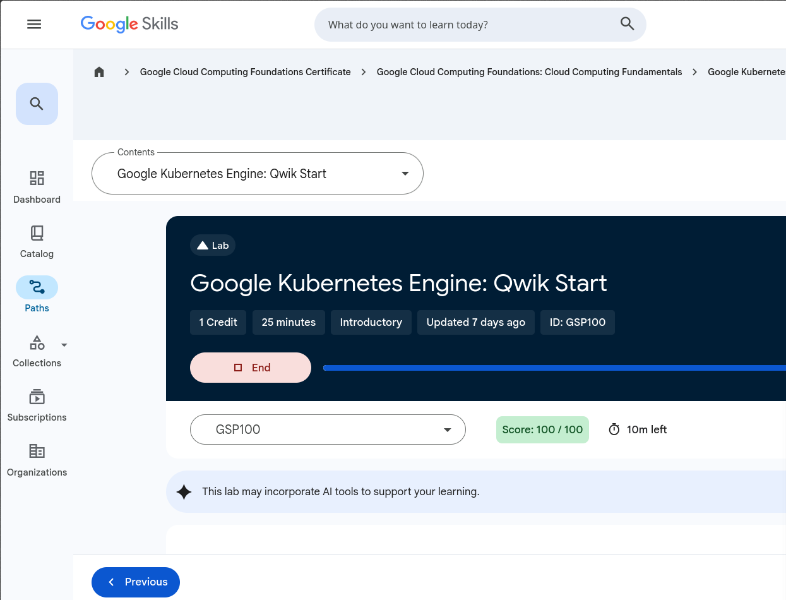
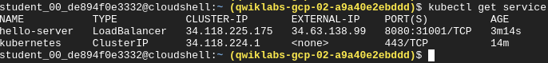
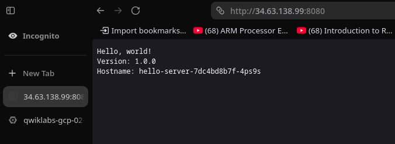

# My Google Kubernetes Engine (GKE) Journey:

Hey everyone! I just completed the **Google Kubernetes Engine: Qwik Start** (GSP100) lab, and I managed to score a perfect **100/100** with 10 minutes still left on the clock! I wanted to document my experience, how I fixed a couple of tricky mistakes along the way, and what the final successful setup looks like.

Here is a quick breakdown of my hands-on experience deploying my very first app on a live GKE cluster.

---

## 🏆 Lab Completion Profile

I was working in a fast-paced sandbox environment and had to spin up a cluster, deploy a sample application container, and expose it via a load balancer. 

*Got that clean 100/100 score badge!*

---

## 🛠️ Exposing the Cluster via LoadBalancer

After setting up the deployment, the next major step was to expose our application container to the real world. I used the `kubectl get service` command to verify that Google Cloud successfully allocated an external IP address for my application routing.

Here is the active network routing inside the Cloud Shell terminal:

*The `hello-server` service working perfectly under an External IP (`34.63.138.99`) over port `8080`.*

---

## 🌐 The Final Result: Hello World!

I did run into a tiny browser trap initially where my browser tried to Google Search the IP instead of navigating to it, but opening an Incognito window and explicitly hitting `http://34.63.138.99:8080` did the trick flawlessly!

Seeing this structural output load up in real-time was incredibly satisfying:

*The application response page detailing the exact dynamic pod hostname `hello-server-7dc4bd8b7f-4ps9s` responding to the load balancer.*

---

## 🧠 Key Takeaways From Today
1. **Typo Prevention:** Double-check image repositories (`-samples` vs `-sample` can break a container pool instantly).
2. **In-Place Swaps:** If a container fails due to a wrong image name, you don't always have to scrap it. Tools like `kubectl set image` let you patch configurations dynamically.
3. **Networking Logic:** Watching Kubernetes sync directly with GCP's hardware load balancer to provisioning an external IP within minutes is absolute magic.

