# Network Basics - CISCO
	* Today i have completed the first checkpoint test in the course network basics.
	* Most of the content upto this i have already acknowledged from my own college syllabus but i took this as an re-Learning chance.
	* But today i get to know about few more new or get more insight about something's like
		-Cellular network
		-Ports in router
		-Little more about cables like co-axial,fibre optics,ethernet cables.
		-First time get to know about DSL cables.
	* Scored 80 percent in the checkpoint with some good satisfaction.but a small regret because of i have not tried the handson activity yet till.
	* So i decided to temperorily stop this course from further moving.
	* I have downloaded the cisco packet tracer , and next thing i am gonna do handson practise and try to do some really intresting stuffs.
	* After that i should move to the next chapter 5.

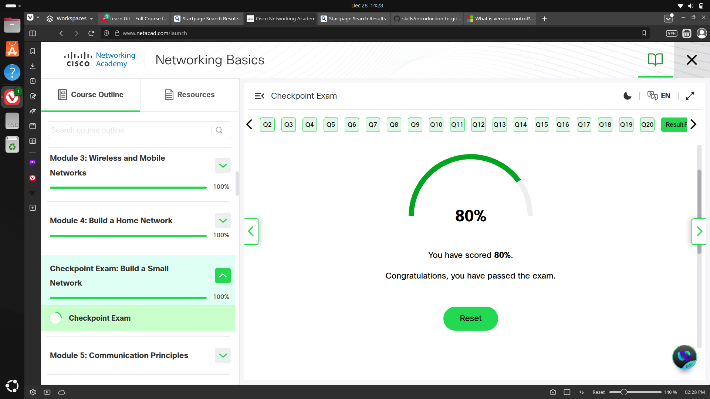

# ------------------------------------------------------------------------------------------

# 2025-12-30
# Hands-On Practise with cisco
	--Spended more then one hours to complete this activity.
	* Today i have complete the first activity given under the course Network basics in cisco.
	* Even some of the things i have already practised in college lab practicals , today i felt much more realistic experiences.
	* Things like straight co-axial cable connection and configuting wirelss router connection which has not ever done by me but today i have completed.
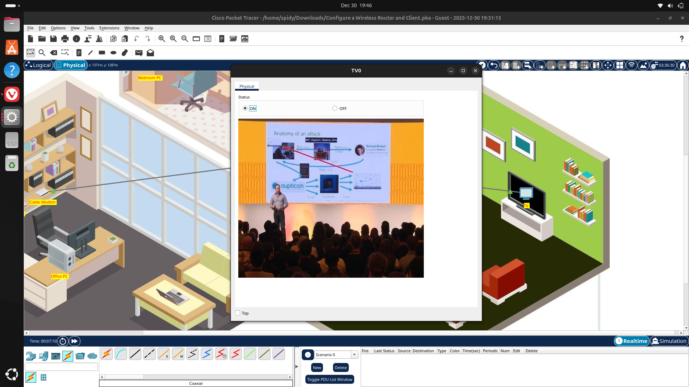
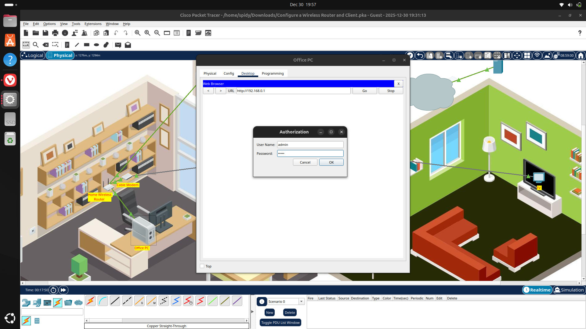
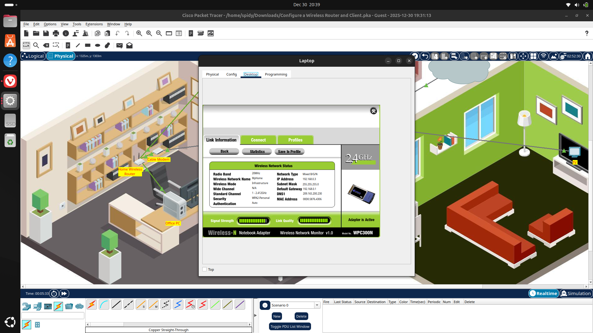
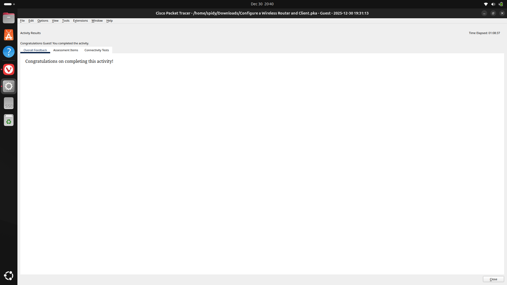

# ------------------------------------------------------------------------------------------

# 2025-12-31
# Completed a small end-test in chapter 5 "Communication Principles"
	--- This chapter almost 90% already well covered by me in college.
	--- by the sysllabus itself. The college syllabus lesson Networking Principles
	--- is were already thought me about almost all the topics.
	* Majaority of this lesson is about OSI 7 layers and TCP/IP protocol stack's.
	* as i already well known to this area i just spend today 5 minutes to complete this chapter and i took the end test.
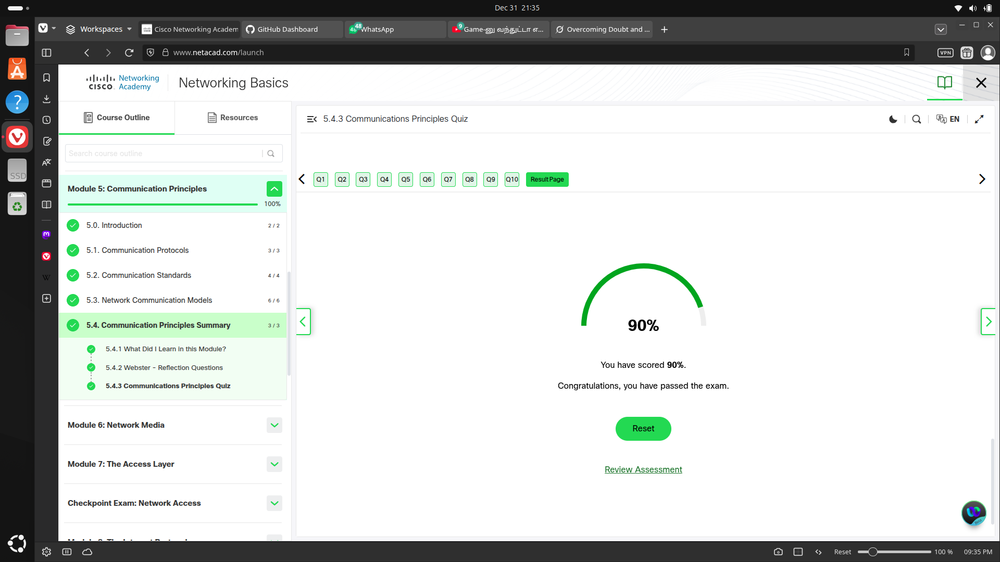

# Followed by chapter 5 -> chapter 6
	* This chapter is all about Network media.
	* Mainly three types 1)Co-axial,2)Twister Pair Cable,3)Fibre Optic cables.
	* Since i knew about these already i easily catup instantly and complete the test too.
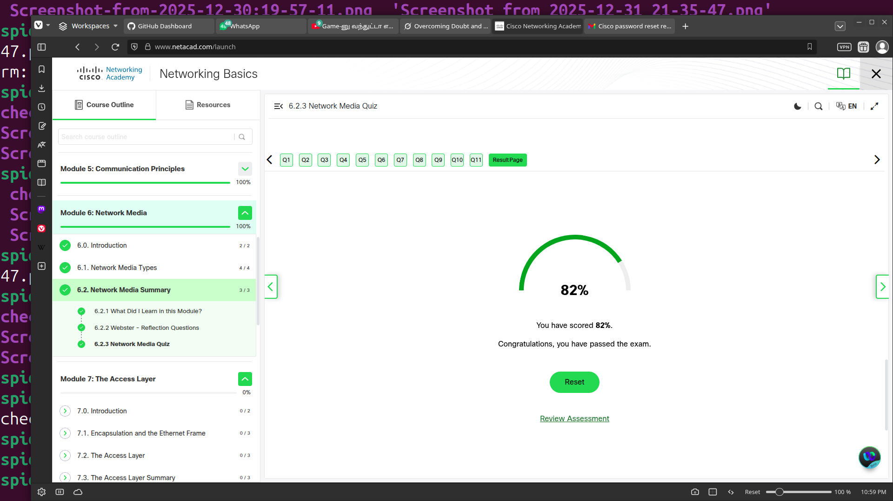
# ------------------------------------------------------------------------------------------

# 2026-01-01
# Moved to chapter 7 
	This chapter is completely took over about the Data-Link layer of the OSI model.
	It explain the Access layer completely
	It includes concepts of 
		* Data encapsulation
		* Ethernet frame header , and Frames representation.
		* Switch MAC Addresee tables building and frame forwading decision strategies.
	Yeah! Again all these concepts are wll known to me took a quick over-through by this and test my understanding level by the test at end.
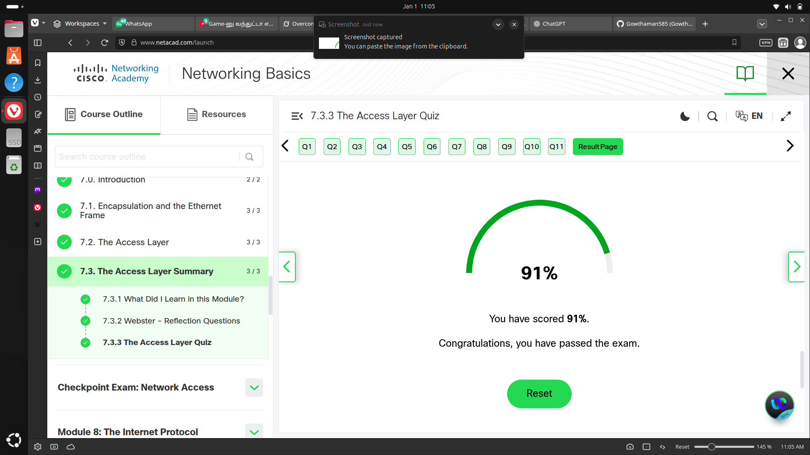
# ------------------------------------------------------------------------------------------

# 2026-01-01
# CheckPoint Test : 2
	I took a checkPoint test 2 to check myu level of understanding upto what i learned from all of those
	I scored 91% . well! let move to next...
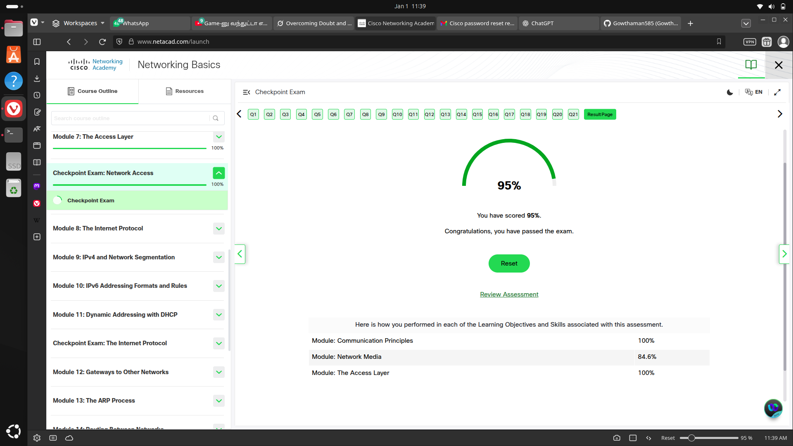
# ------------------------------------------------------------------------------------------

# 2026-01-01
# Chapter 8
	This chapter is all about intro ipV4 addressing.
	I have more then enough stuffs to study this so i quickly wrap this chapter within 10 minutes
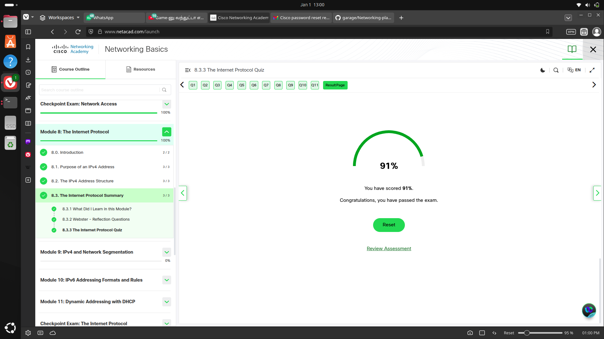
# ------------------------------------------------------------------------------------------

# 2026-01-01
# Chapter 9
	This chapter helped me to strongly practise me with public,private and classes of ipv4 addresses.
	I can able to re-memorize the ipaddress ranges and classes once again.
	This chapter helps me to clearly understand why subnetting is important in ip adressing.
		* to avoid trafiic slow down due to un-necessary broadcast traffic to unwanted devices.
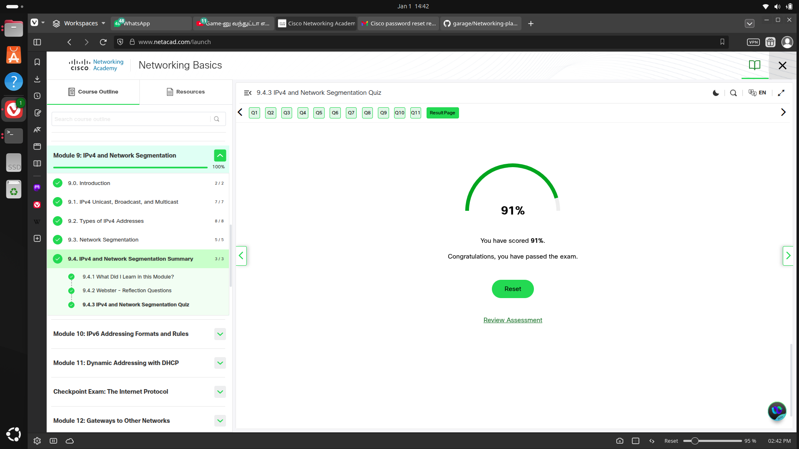
# -------------------------------------------------------------------------------------------

# 2026-01-01
# Chapter 10 
	This chapter is for ipv6.
	I get know about multiple things about in ipv6 today:
		* ipv6 is represented as hextets.(it's unofficial term).
		* Each hextet is 16 bit length and there are 8 hextet in ipv6.
		Rules for ipv6 representation :
			* Remove all leading zeros
			* we can use "::" for multiple hextet uses '0000' as their value.
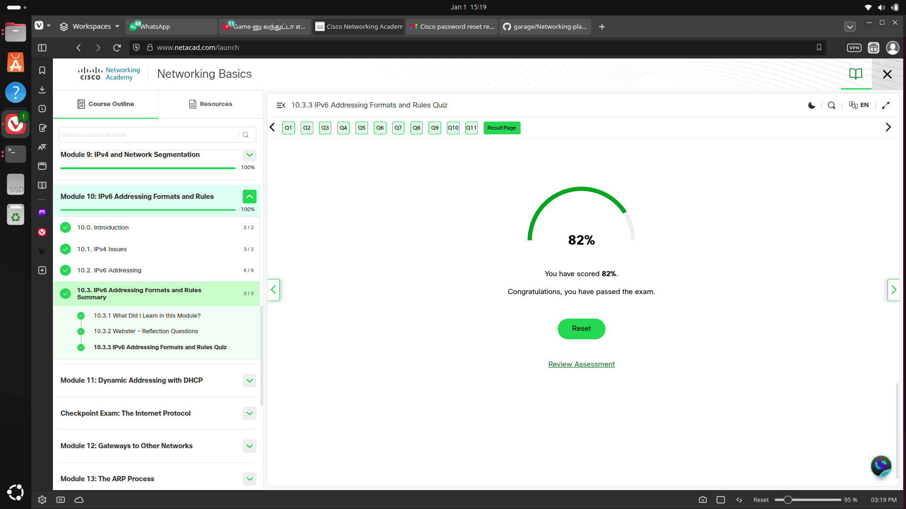
# --------------------------------------------------------------------------------------------

# 2026-01-01
# Chapter 11
	This chapter explain about DHCP protocols how it works etc..
	I can able to get to know how a client recives the ip addpress dynamically via DHCP server.
		* The client broadcast a message "DHCP discover" to a broadcast ip address of 255.255.255.255.
		* The DHCP server recieves the message and replyb "DHCP OFFER" with the client ip address.
		* The client again request the server for a particular lease time and confirmation as "DHCP request".
		* The server confirms with the lease time and usage of ip with "DHCP pack".

	--- At the first time i have failed in this chapter end-test but i again tries and i correct my mistakes to pass in this text with 82%.
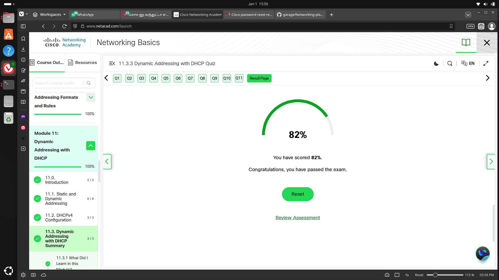
# ---------------------------------------------------------------------------------------------

# 2026-01-01
# CheckPoint test : 3
	I have done some mistakes during this test. 
	Silly misunderstanding of the question leads to score one my lowest scores in this course with just 75%.
	but it okey for me , that i have passed the test now.
	Now go to next ..
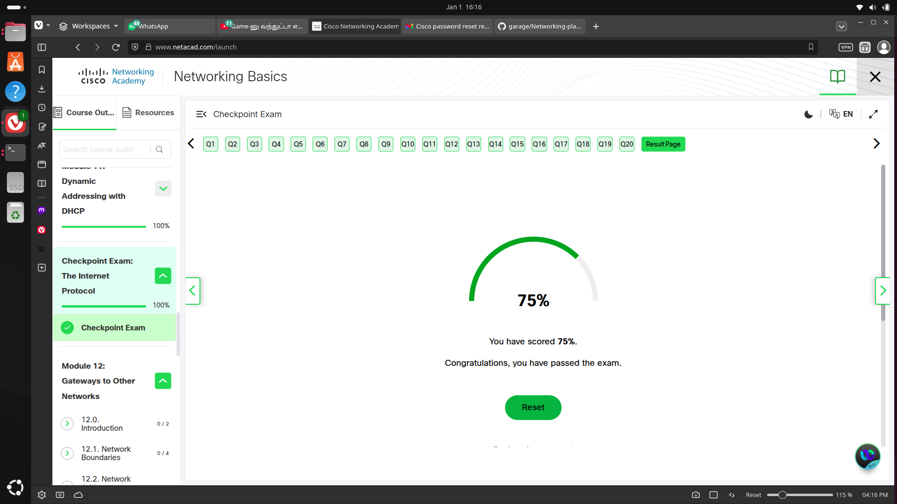
# ----------------------------------------------------------------------------------------------

# 2026-01-01
# Chapter 12
	This chapter really intreseted me by explaining about the use of NAT purpose in internet.
	This chapter clearly explains how NAT works to help the device to commuincate outside of it network.
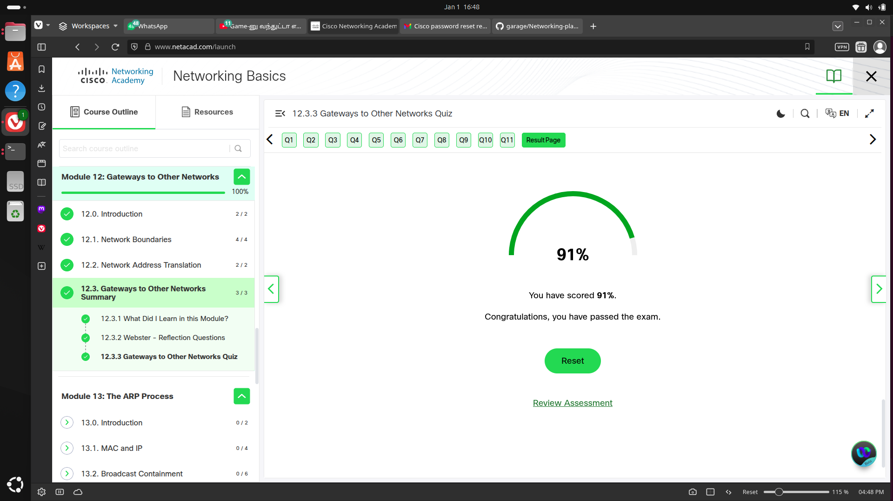

# 2026-01-02
# Second Activity of this course for better understanding about NAT
	-- Successfully completed the NAT chapter activity
	-- Here i newly get to know about PDU Protocol Data unit which is send over the end-device to a web server outside of local network
	-- with the help of public ip adrress provided by the ISP to the router internet port.

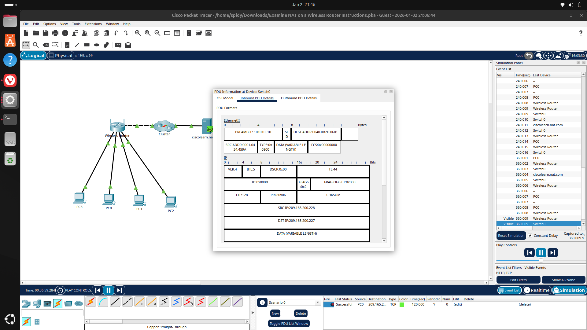
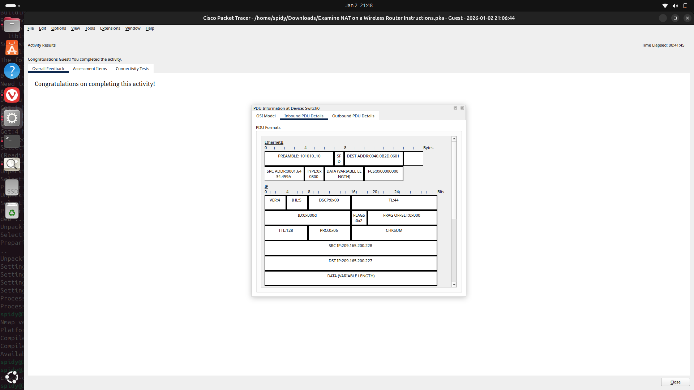
# ---------------------------------------------------------------------------------------------

# 2026-01-04
# Chapter 13
	Today i get know about the purpose of ARP (Address Resolution Protocol)
	Even though i introduced with ARP i just known about the full-form but today i understand the real purpose and flow of work of ARP
	How the brodcast the ARP request to the switches and routers with the target ip and flodding the broadcast into local network with FFFF:FFFF:FFFF:
	- Also i have completed a small activity for this chapter in cisco
	- The activity may look very small but every answer i need to look deep to retrive the correct answer
	- offcourse it quiet challenging for me little.
	I also completed the end test for this chapter i failed twice and then i realize my mistakes and tried it again.
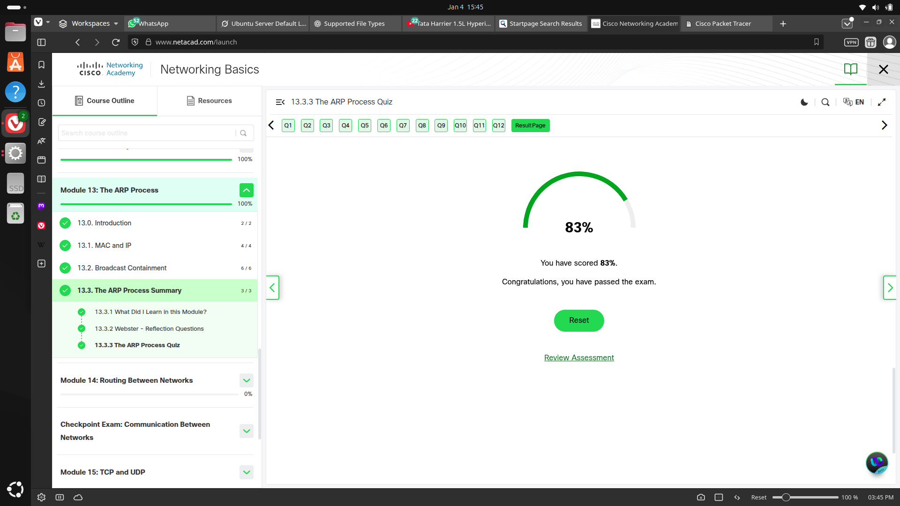
# Activity : 3
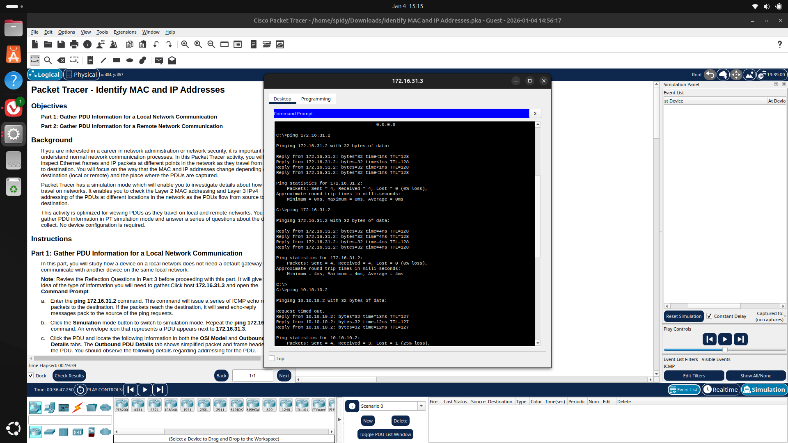
# ---------------------------------------------------------------------------------------------

# 2026-01-05
# Chapter 14
	In this chapter lot of packet tracer activity has done.
	Got with the crystal clear understanding of how router is used in local network to separat them in different broadcast domain.
	How end-point device find the destination mac addrress if it is not known , it was simulated in packet tracer clearly.
	That help a lot to understand clearly
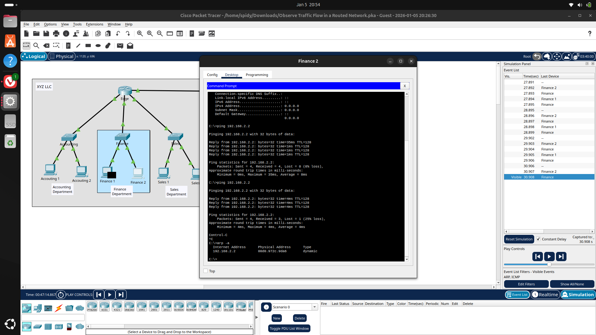
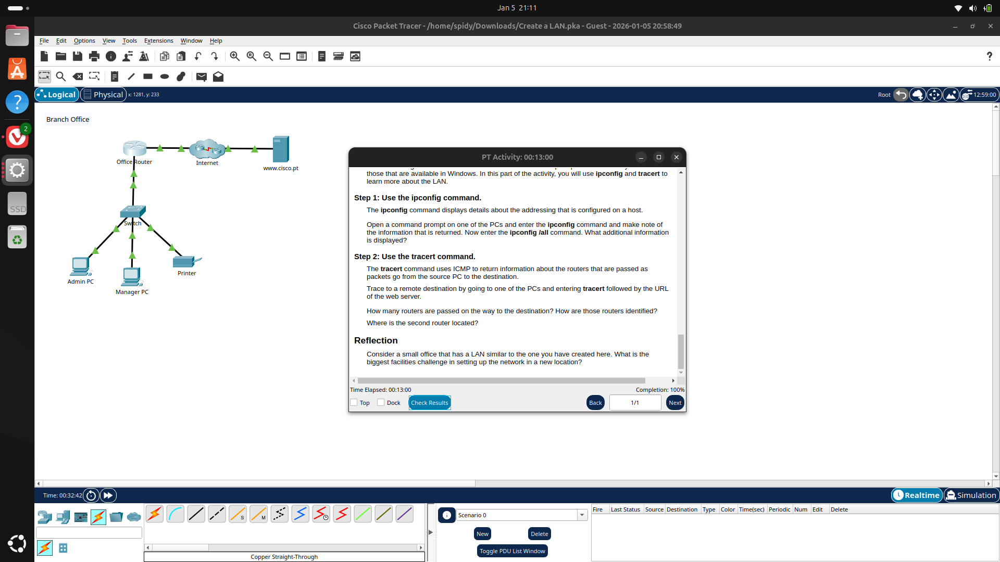

# End test of chapter 14
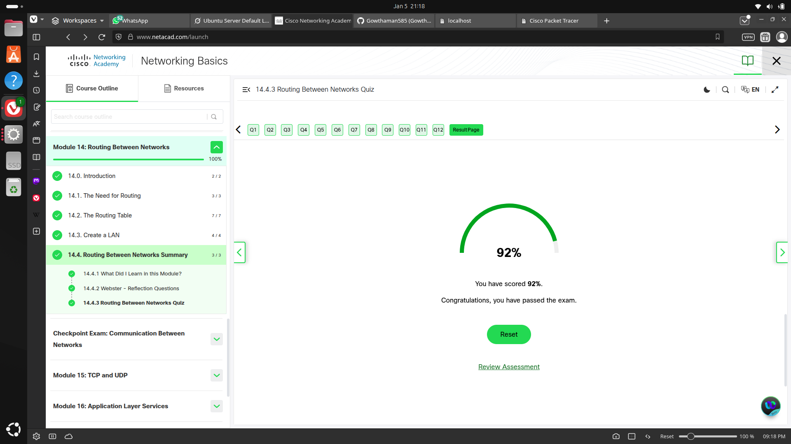

# CheckPoint test 4 :
	Tested my memory ability that i properly understand the question and pick the right answer in the 4th checkpoint.
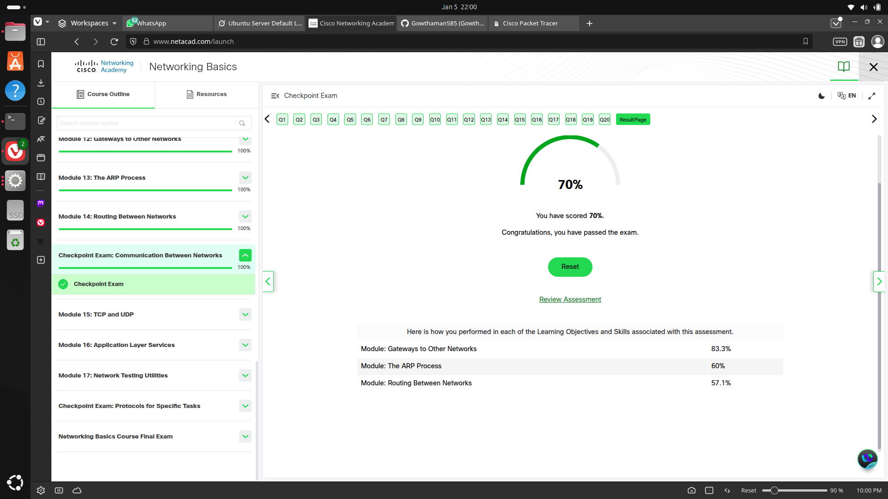
# ----------------------------------------------------------------------------------------------
