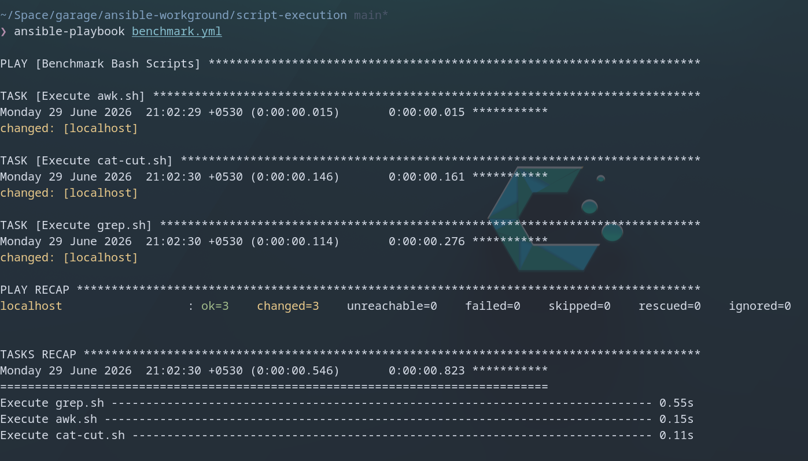

# Parsing SSH Auth Logs with Bash + Ansible 🔍📋

A small hands-on exercise where I used three different Bash one-liners to extract SSH login activity from a server auth log — then automated running all of them with Ansible.

---

## The Problem

I had a raw `auth.log` file full of SSH events — accepted logins, failed password attempts, disconnections, the works. The goal was to filter out just the meaningful security events (accepted and failed logins) using three different CLI tools, and see how each one approaches the same task differently.

---

## The Three Scripts

### 1. `awk.sh` — Field-based filtering

```bash
#!/bin/bash
awk '{ if ( $6 == "Accepted" || $6 == "Failed" ) print }' auth.log
```

`awk` reads the log line by line and checks the 6th whitespace-separated field. If it's `Accepted` or `Failed`, it prints the whole line. Clean and precise.

---

### 2. `cat-cut.sh` — Extract a single column

```bash
#!/bin/bash
cat auth.log | cut -d " " -f 7
```

Pipes the file through `cut` to slice out just the 7th field (the username/action word) using space as the delimiter. Great for getting a quick list of what's happening without the noise.

---

### 3. `grep.sh` — Regex pattern matching

```bash
#!/bin/bash
grep -E "^[^:]+:[^:]+:[^:]+ [^ ]+ sshd\[[0-9]+\]: (Accepted|Failed)" auth.log
```

Uses an extended regex to match lines that come from `sshd` and contain either `Accepted` or `Failed`. More explicit than `awk` but gives you full control over the pattern.

---

## The Ansible Automation 🤖

Instead of running each script manually one by one, I set up a simple Ansible playbook to execute all three automatically.

**`ansible.cfg`**
```ini
[defaults]
inventory = ./inventory
host_key_checking = False
callbacks_enabled = ansible.posix.profile_tasks
```

**`inventory`**
```ini
[local]
localhost ansible_connection=local
```

**`benchmark.yml`**
```yaml
---
- name: Benchmark Bash Scripts
  hosts: local
  gather_facts: false
  tasks:
    - name: Execute awk.sh
      ansible.builtin.script: ./awk.sh
    - name: Execute cat-cut.sh
      ansible.builtin.script: ./cat-cut.sh
    - name: Execute grep.sh
      ansible.builtin.script: ./grep.sh
```

Run it with:

```bash
ansible-playbook benchmark.yml
```

The `profile_tasks` callback in `ansible.cfg` automatically times each task — so you can actually see which tool is fastest. That's the benchmarking part. ⏱️

---

## What I Learned

- `awk`, `grep`, and `cut` can all solve the same filtering problem but in very different ways — knowing when to reach for which one matters.
- `awk` is great when you care about specific fields and want conditional logic.
- `grep` is your go-to when you're matching patterns across the whole line.
- `cut` is the simplest — no logic, just "give me column N."
- Wrapping scripts in an Ansible playbook is a neat way to benchmark or batch-run them without writing a wrapper script yourself.

---

*Part of my ongoing Linux + DevOps learning notes.*
