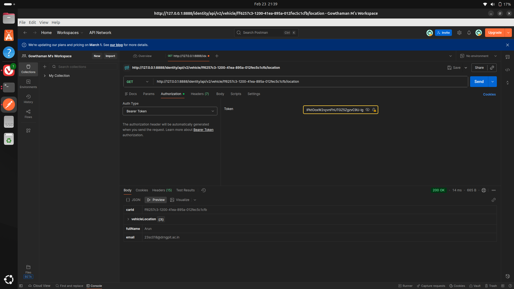

# API PENTESTING  
## I HAVE SET UP MINE OWN crAPI IN MY DEVICE VIA DOCKER TO EXPLORE THE TOP 10 OWASP API VULNERABILITIES.  
I HAVE STUDIES SOME GOOD PRE-REQUESTIES BEFORE THIS HANDSON.  
TODAY : 23/02/2026
I have successfulyy tries my first pentest in crAPI.  
I exploited the BOLA vulnerabilite in the crAPI.  
## HOW I CAN ABLE TO DONE THIS  
1)I have created two accounts in the website of crAPI.Each accout has separte mail.  
2)I have posted a post on the comment tab where i can able to find a url which contains the unique uuid of the vehicle.  
3)I copies the uuid url and replace the uuid with the second user url.to test against the BOLA vulnerability.  
# SCREEN SHOTS  
  
  

