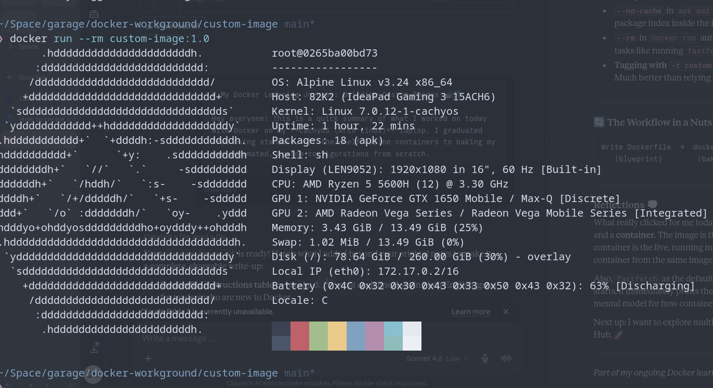

# My Docker Learning Journey: Building Custom Images 🐋🛠️

Hey everyone! This is a quick summary of what I worked on today with Docker on my **CachyOS (Arch Linux)** laptop. I graduated from using standard, off-the-shelf Alpine containers to baking my own automated, custom configurations from scratch.

---

## 🛠️ Custom Blueprint Baking (`Dockerfile` & `docker build`)

Instead of manually configuring a container environment every time I turn it on, I learned how to use a text blueprint file to automate the setup and build my own standalone system image.

### My Dockerfile Recipe:

```dockerfile
FROM alpine:latest

# Keep the image light by skipping the temporary download index cache files
RUN apk add --no-cache fastfetch

# Set up an automated working workspace directory inside
WORKDIR /app

# Run the system auditing tool automatically on startup
CMD ["fastfetch"]
```

### What I Did:

1. Created a fresh folder at `~/Space/garage/docker-workground/docker-build`.
2. Created and edited a file named `Dockerfile` using `vim`.
3. Baked the recipe into a reusable local image using the tag (`-t`) flag:

```bash
docker build -t custom-image:1.0 .
```

4. Ran my brand-new custom environment with automatic cleanup enabled:

```bash
docker run --rm custom-image:1.0
```

And here's the proof — `fastfetch` fired up instantly inside the container, printing full system info for the Alpine Linux environment running on my machine: 🖥️



---

## 🧠 What Each Dockerfile Instruction Does

| Instruction | What it means |
|---|---|
| `FROM alpine:latest` | Start from a minimal Alpine Linux base — tiny and fast |
| `RUN apk add --no-cache fastfetch` | Install `fastfetch` without caching the index (keeps image slim) |
| `WORKDIR /app` | Set `/app` as the default working directory inside the container |
| `CMD ["fastfetch"]` | Run `fastfetch` automatically every time the container starts |

---

## 💡 Key Concepts I Picked Up

- **A `Dockerfile` is a blueprint** — it describes *exactly* how to build an image, step by step. No more manual setup every time.
- **`docker build`** reads that blueprint and produces a reusable, portable image stored locally.
- **`--no-cache`** in `apk add` is a good habit — it prevents Alpine from storing the package index inside the image layer, shaving off unnecessary size.
- **`--rm`** in `docker run` auto-removes the container after it exits — great for one-shot tasks like running `fastfetch` so you don't accumulate dead containers.
- **Tagging with `-t custom-image:1.0`** makes images easy to identify and version. Much better than relying on random generated IDs.

---

## 🔄 The Workflow in a Nutshell

```
Write Dockerfile  →  docker build  →  Local Image  →  docker run
   (blueprint)        (bake it)       (your artifact)   (use it)
```

---

## Reflections 💭

What really clicked for me today was understanding the difference between an **image** and a **container**. The image is the frozen, reusable blueprint (like a class in OOP), and the container is the live, running instance (like an object). Every `docker run` spins up a fresh container from the same image — totally clean every time.

Also, `fastfetch` as the default `CMD` is a satisfying demo — the moment the container starts, it immediately prints the system info and exits. Clean, purposeful, and a good mental model for how containers *should* work: do one thing, do it well.

Next up: I want to explore multi-stage builds and maybe push a custom image to Docker Hub. 🚀

---

*Part of my ongoing Docker learning notes on CachyOS / Arch Linux.*
